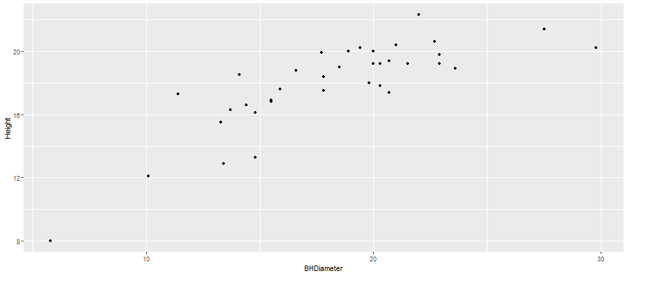
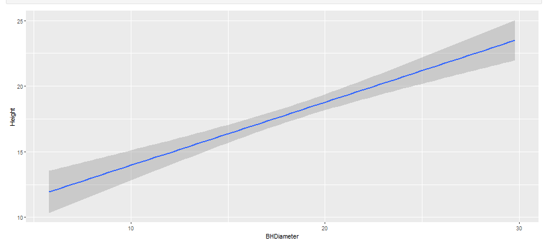
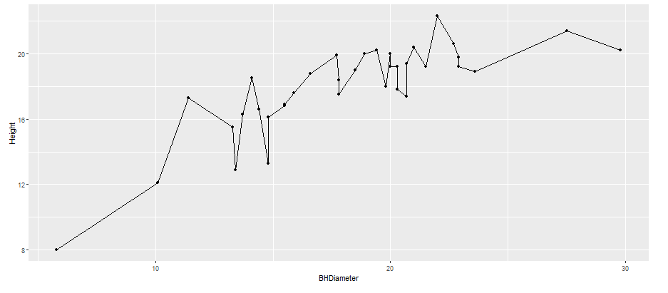

```{r setup, include=FALSE}
knitr::opts_chunk$set(echo = TRUE)
```


# Parts

## Part 1

```{r}
getwd()
```

## Part 2

```{r}
spruce = read.csv("SPRUCE.csv")
head(spruce)
```

## Part 3

```{r}
with(spruce,  {
plot(Height~BHDiameter,bg="Blue",pch=21, xlab = "BHDiameter (cm)", ylab = "Height (m)", main = "Diameter vs. Height of spruce trees", xlim = c(0,1.1*max(BHDiameter)), ylim = c(0,1.1*max(Height)), cex = 1.2)
 }
)
```

The scatter plot above does not appear to follow a straight line relationship but rather one that slowly decays as diameter increases. 

```{r}
library(s20x)
layout(matrix(1:3,nr=3,nc=1,byrow=TRUE))
trendscatter(Height~BHDiameter,f=0.5, data=spruce, main = "Height vs. BHDiameter f=0.5")
trendscatter(Height~BHDiameter,f=0.6, data=spruce, main = "Height vs. BHDiameter f=0.6")
trendscatter(Height~BHDiameter,f=0.7, data=spruce, main = "Height vs. BHDiameter f=0.7")
```

```{r}
spruce.lm=with(spruce, lm(Height~BHDiameter))
with(spruce,  {
plot(Height~BHDiameter,bg="Blue",pch=21, xlab = "BHDiameter (cm)", ylab = "Height (m)", main = "Diameter vs. Height of spruce trees", xlim = c(0,1.1*max(BHDiameter)), ylim = c(0,1.1*max(Height)), cex = 1.2)
 }
)
abline(spruce.lm)
```

The straight line does not seem to be the best fit as it doesn't quite trace out the full path of the data points. The 3 trendsetter plot demonstrate that the data is better traced by a curved trendline.

## Part 4

```{r}
layout(matrix(1:4,nr=2,nc=2,byrow=TRUE))
layout.show(4)
```

```{r}
layout(matrix(1:4,nr=2,nc=2,byrow=TRUE))
yhat=with(spruce,predict(spruce.lm,data.frame(Height)))
with(spruce,  {
plot(Height~BHDiameter,bg="Blue",pch=21, xlab = "BHDiameter (cm)", ylab = "Height (m)", main = "Diameter vs. Height of spruce trees", xlim = c(0,1.1*max(BHDiameter)), ylim = c(0,1.1*max(Height)), cex = 1.2)
 }
)
abline(spruce.lm)


yhat=with(spruce,predict(spruce.lm,data.frame(Height)))
with(spruce,  {
plot(Height~BHDiameter,bg="Blue",pch=21, xlab = "BHDiameter (cm)", ylab = "Height (m)", main = "RSS", xlim = c(0,1.1*max(BHDiameter)), ylim = c(0,1.1*max(Height)), cex = 1.2)
 }
)
with(spruce,{
segments(BHDiameter,Height,BHDiameter,yhat)
})
abline(spruce.lm)


with(spruce,  {
plot(Height~BHDiameter,bg="Blue",pch=21, xlab = "BHDiameter (cm)", ylab = "Height (m)", main = "MSS", xlim = c(0,1.1*max(BHDiameter)), ylim = c(0,1.1*max(Height)), cex = 1.2)
 }
)
with(spruce, abline(h=mean(Height)))
with(spruce, segments(BHDiameter, mean(Height), BHDiameter, yhat, col = "RED"))
abline(spruce.lm)


with(spruce,  {
plot(Height~BHDiameter,bg="Blue",pch=21, xlab = "BHDiameter (cm)", ylab = "Height (m)", main = "TSS", xlim = c(0,1.1*max(BHDiameter)), ylim = c(0,1.1*max(Height)), cex = 1.2)
 }
)
with(spruce, abline(h=mean(Height)))
with(spruce, segments(BHDiameter, mean(Height), BHDiameter, Height, col = "GREEN2"))
```

The TSS, MSS, and RSS calculations are shown respectively:

```{r}
RSS = with(spruce,sum((Height-yhat)^2))
MSS = with(spruce, sum((yhat-mean(Height))^2))
TSS = with(spruce,sum((Height-mean(Height))^2))
RSS
MSS
TSS
```

The value of MSS/TSS is calculated below:

```{r}
MSS/TSS
```

This value of 0.6569 is the R squared value for the linear interpretation. The R squared value is used to interpret how well a line models the relationship of the data. This value tells us the linear line a moderate fit, but ultimately not a good fit for the data as it fairly lower than 1(meaning a perfect fit).

```{r}
MSS + RSS
```
As shown above, our values for MSS and RSS add to get a sum that is the same value as our TSS. This makes sense as the MSS and RSS are partials of the TSS and segmented about the same lines for computation.

## Task 5

```{r}
summary(spruce.lm)
```

```{r}
coef(spruce.lm)
```

The slope of the line is 0.4815 and intersepts the y-axis at 9.147. The line can be represented by the equation:
$$y = 0.4815x + 9.147$$
The equation above is used to predict the height of trees with diameters of 15, 18, and 20 with results shown below.
```{r}
predict(spruce.lm, data.frame( BHDiameter = c(15,18,20)))
```

## Task 6

```{r}
library(ggplot2)
g = ggplot(spruce, aes(x = BHDiameter, y = Height, color = BHDiameter))
g=g+geom_point() + geom_line()+ geom_smooth(method="lm")
g+ggtitle("Height Vs BHDiameter")
```

## Task 7

{ width=70% }


{ width=70% }


{ width=70% }


